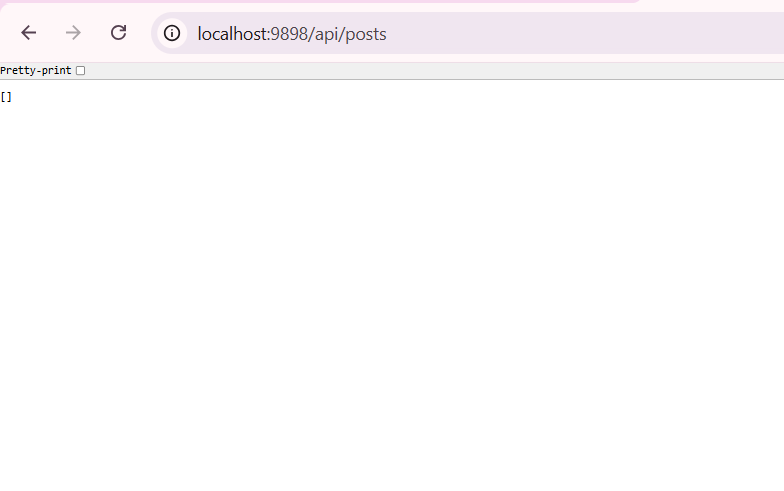
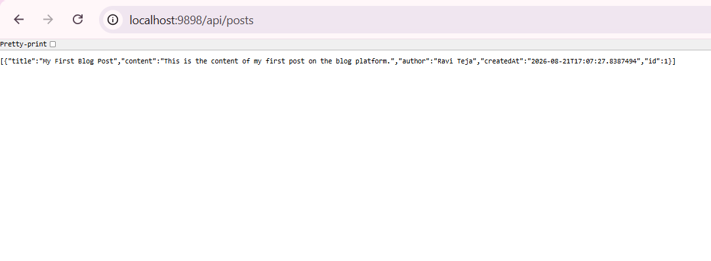
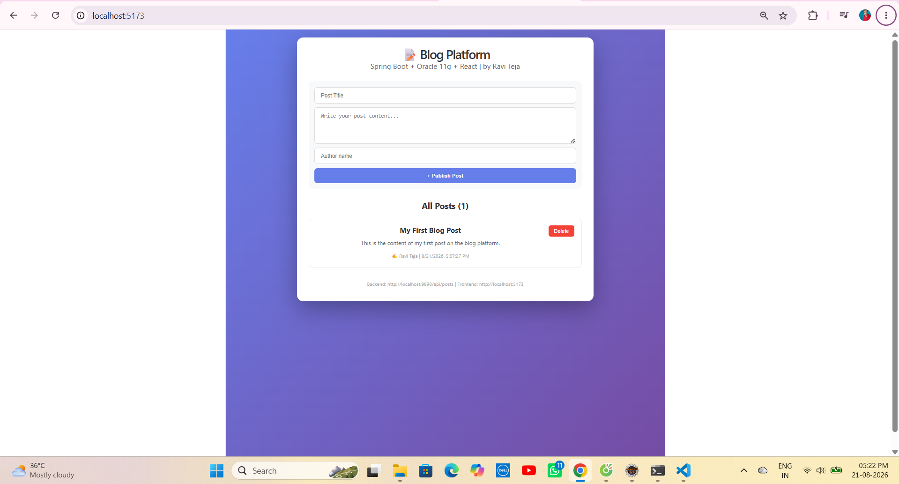
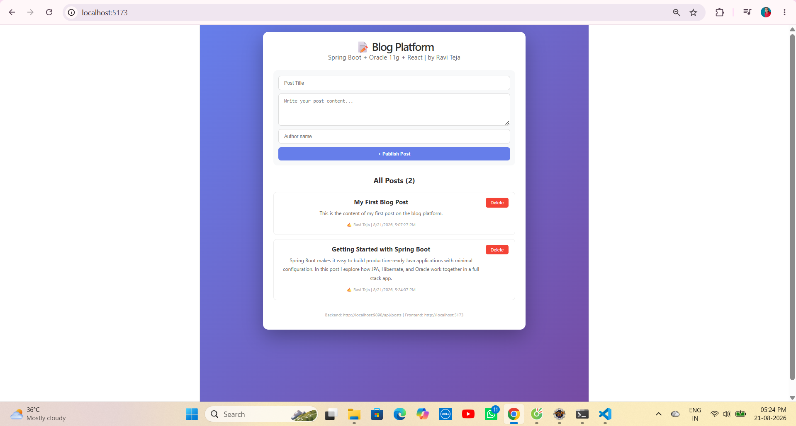
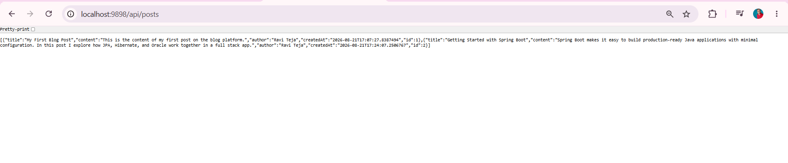
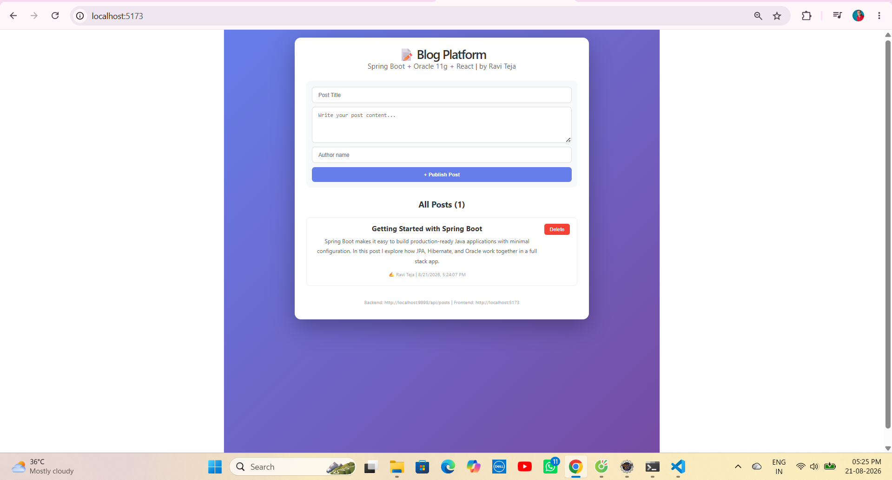
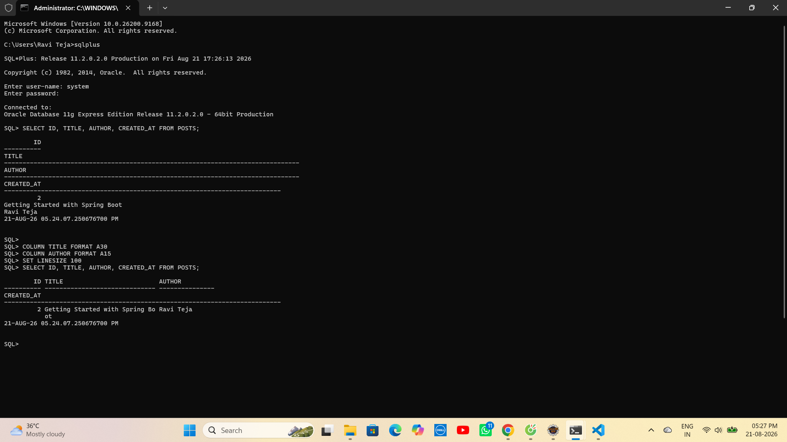

# 📝 Project 64 – Blog Platform | Spring Boot + Oracle 11g + React | Two Repo Full Stack

<p align="left">


</p>

---

# 📖 Project Overview

**Blog Platform** is **Project 64** of **Tier 7 – Full Stack Integration**, developed using **Spring Boot 4.1.1**, **Oracle 11g Express**, **Spring Data JPA**, **Hibernate**, **Spring Security**, and **React 19 + Vite + Axios**.

React frontend runs on **port 5173** and communicates with the Spring Boot REST API running on **port 9898** through Axios.

The backend provides REST endpoints for:

- `GET /api/posts`
- `GET /api/posts/{id}`
- `POST /api/posts`
- `PUT /api/posts/{id}`
- `DELETE /api/posts/{id}`

The frontend displays:

- Blog Platform header
- Post creation form (title, content, author)
- Publish Post button
- List of all posts with author + timestamp
- Delete button per post
- Responsive card layout

This project uses a **two repository / two folder architecture** containing both backend and frontend.

---

# ✨ Features

## ✍️ Create Post

- Title, content, and author fields
- Validation on empty title/content
- Auto timestamp on creation

## 📋 List Posts

- Fetches all posts from Oracle via REST
- Displays author and formatted created date
- Live post count

## 🗑 Delete Post

- One-click delete
- Instantly removed from UI and Oracle

## 🔐 Security

- Spring Security included in the stack
- Endpoints open for development (permitAll), ready to be secured with real auth in later tiers

---

# 🛠 Technologies Used

| Technology | Version |
|---|---|
| React | 19.0.0 |
| Java | 21 |
| Spring Boot | 4.1.1 |
| Spring Data JPA / Hibernate | 7.4.5 |
| Spring Security | 4.1.1 |
| Oracle Database | 11g Express Edition |
| Axios | 1.6+ |
| Vite | 8.2.2 |
| Maven | 3.9+ |

---

# 📂 Project Structure

```text
64-blog-platform/
│
├── backend/
│   └── 64-blog-platform-backend/
│       ├── src/main/java/com/raviteja/blog/
│       │   ├── Application.java
│       │   ├── config/
│       │   │   └── SecurityConfig.java
│       │   ├── controller/
│       │   │   └── PostController.java
│       │   ├── entity/
│       │   │   └── Post.java
│       │   └── repository/
│       │       └── PostRepository.java
│       ├── src/main/resources/
│       │   └── application.properties
│       └── pom.xml
│
├── frontend/
│   └── 64-blog-platform-frontend/
│       ├── src/
│       │   ├── App.jsx
│       │   ├── main.jsx
│       │   └── index.css
│       ├── package.json
│       └── package-lock.json
│
├── screenshots/
├── .gitignore
└── README.md
```

---

# ▶️ How to Run

## 1. Clone Repository

```bash
git clone https://github.com/raviteja-dev950/64-blog-platform.git
cd 64-blog-platform
```

## 2. Backend

```properties
server.port=9898
spring.application.name=blog-platform
spring.datasource.url=jdbc:oracle:thin:@localhost:1521:XE
```

Run:

```text
Run As → Spring Boot App
```

Backend:

```text
http://localhost:9898/api/posts
```

## 3. Frontend

```bash
cd frontend/64-blog-platform-frontend
npm install
npm install axios
npm run dev
```

Frontend:

```text
http://localhost:5173
```

## 4. Axios

```javascript
const API_URL = "http://localhost:9898/api/posts";
```

---

# 🔄 Application Flow

```text
User
 │
 ▼
React UI (5173)
 │
 ├── Create Post
 ├── View Posts
 └── Delete Post
 │
 ▼
Axios
 │
 ▼
Spring Boot API (9898)
 │
 ├── /posts (GET, POST)
 └── /posts/{id} (GET, PUT, DELETE)
 │
 ▼
Hibernate + Sequence Generator
 │
 ▼
Oracle 11g XE (POSTS table)
```

---

# 🧪 API Testing

## All Posts

```bash
curl http://localhost:9898/api/posts
```

## Create Post

```bash
curl -X POST http://localhost:9898/api/posts -H "Content-Type: application/json" -d "{\"title\":\"My First Blog Post\",\"content\":\"Content here\",\"author\":\"Ravi Teja\"}"
```

## Delete Post

```bash
curl -X DELETE http://localhost:9898/api/posts/1
```

---

# 📡 API Endpoints

| Method | Endpoint |
|---|---|
| GET | `/api/posts` |
| GET | `/api/posts/{id}` |
| POST | `/api/posts` |
| PUT | `/api/posts/{id}` |
| DELETE | `/api/posts/{id}` |

---

# 🗄 Database Note

Oracle 11g does not support `GenerationType.IDENTITY`. The `Post` entity uses a **sequence-based ID strategy** (`POST_SEQ`) instead, which is fully compatible with Oracle 11g XE.

Verified directly in SQL\*Plus:

```sql
SELECT ID, TITLE, AUTHOR, CREATED_AT FROM POSTS;
```

---

# 📸 Screenshots









---

# 🎯 Learning Outcomes

- Spring Boot REST APIs with Spring Security enabled
- Oracle 11g sequence-based primary key generation
- Spring Data JPA + Hibernate schema auto-update
- React Hooks (useState, useEffect)
- Axios full CRUD integration
- End-to-end verification via SQL\*Plus
- Two-folder full stack repo structure

---

# 🚀 Future Enhancements

- Edit Post UI
- Post detail page
- Spring Security with real login (JWT)
- Pagination
- Rich text editor
- Deploy to Render/Vercel

---

# 👨💻 Author

**Ravi Teja**

Java Full Stack Developer

100 Java Full Stack Projects Challenge

**Project 64 / 100**

Tier 7 – Full Stack Integration

---

# ⭐ Support

If you found this project helpful, consider giving it a ⭐ Star on GitHub.

## Repo

```text
https://github.com/raviteja-dev950/64-blog-platform
```

## Backend

```text
backend/64-blog-platform-backend/
Port: 9898
```

## Frontend

```text
frontend/64-blog-platform-frontend/
Port: 5173
```
